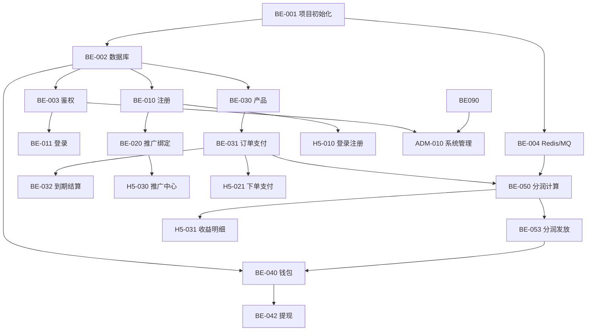

# 碳交易理财推广系统 — 开发任务明细

**版本**: v1.0  
**关联文档**: [开发规范](./开发规范.md) · [开发手册](./开发手册.md) · [碳交易 PRD](./碳交易.md) · [运营文档](./运营文档.md)

---

## 1. 文档说明

### 1.1 用途

本文档将系统开发拆解为 **可分配、可验收、可追踪** 的任务项，供项目管理、排期与 Code Review 使用。

### 1.2 任务编号规则

| 前缀 | 含义 |
| ---- | ---- |
| `BE-` | 后端（Node.js / NestJS） |
| `H5-` | H5 用户端（uni-app） |
| `ADM-` | 管理后台（admin-web） |
| `OPS-` | 运维 / CI/CD / 部署 |
| `QA-` | 测试与验收 |

### 1.3 优先级

| 级别 | 含义 |
| ---- | ---- |
| **P0** | 阻塞上线，必须完成 |
| **P1** | 核心功能，首版必须 |
| **P2** | 重要但可二期 |
| **P3** | 优化项 |

### 1.4 状态标记

| 标记 | 含义 |
| ---- | ---- |
| ✅ 已完成 | 代码已落地且基本可用 |
| 🔄 进行中 | 部分完成，需继续 |
| ⬜ 未开始 | 尚未开发 |
| 📋 参考已有 | Go 版有实现，Node 重写需对齐 |

### 1.5 工时估算说明

- 单位为 **人日**（1 人全职 1 天）
- 含开发 + 自测，不含联调缓冲
- 供排期参考，实际按团队人数调整

---

## 2. 里程碑规划

```
M0 工程就绪          Week 1-2
M1 用户与推广闭环    Week 3-5
M2 投资与资金闭环    Week 6-8
M3 分润与结算闭环    Week 9-11
M4 管理端全功能      Week 10-12（与 M3 并行）
M5 联调测试上线      Week 13-14
```

| 里程碑 | 目标 | 核心交付 |
| ------ | ---- | -------- |
| **M0** | 三端工程脚手架就绪 | NestJS 项目、Prisma Schema、H5/Admin 联调环境 |
| **M1** | 用户能注册、绑定推广、登录 | 注册/登录 API、推广关系、H5 登录注册页 |
| **M2** | 用户能购买理财产品 | 产品 CRUD、下单支付、到期结算 |
| **M3** | 分润自动计算与发放 | MQ 分润、流水入账、推广收益可查 |
| **M4** | 管理员能运营全系统 | RBAC、用户/订单/分润/风控/统计后台 |
| **M5** | 测试通过，可部署生产 | E2E 测试、Docker、监控告警 |

**预估总工时**：约 80–100 人日（2–3 人团队 6–8 周）

---

## 3. 当前进度快照

> 基于 `新建文件夹/` 下现有代码梳理，Node.js 后端尚未启动。

### 3.1 后端（Go 参考实现 → Node 重写）

| 模块 | Go 状态 | Node 状态 | 说明 |
| ---- | ------- | --------- | ---- |
| 用户注册/登录 | 📋 已有 | ⬜ | handler + service + JWT |
| 推广关系 | 📋 已有 | ⬜ | promotion 模块 |
| 产品 | 📋 已有 | ⬜ | CRUD 基本完成 |
| 订单 | 📋 已有 | ⬜ | 缺支付回调完善 |
| 资金/钱包 | 📋 已有 | ⬜ | 缺充值回调 Notify |
| 分润 | 📋 部分 | ⬜ | calculator 有框架，规则待完善 |
| 风控 | 📋 已有 | ⬜ | 规则 + 事件 + 处置 |
| 管理端 RBAC | 📋 已有 | ⬜ | admin + sys_menu/role |
| Banner/文章 | 📋 已有 | ⬜ | content 模块 |
| 数据统计 | 📋 已有 | ⬜ | stats 模块 |
| MQ / 定时任务 | 🔄 部分 | ⬜ | mq.go + task.go 框架有，消费者不完整 |
| JWT 鉴权中间件 | 🔄 部分 | ⬜ | middleware/auth.go 有，RBAC 挂载不完整 |

### 3.2 H5 用户端

| 页面/功能 | 状态 | 说明 |
| --------- | ---- | ---- |
| 首页 | 🔄 | `pages/index`，需接 Banner/产品入口 |
| 登录/注册 | 🔄 | 有页面，需对齐 API + 推广参数 |
| 碳交易产品列表/详情 | 🔄 | `pages/carbon`，需接 product API |
| 资讯列表/详情 | 🔄 | `pages/consultation`，需接 article API |
| 订单列表/详情/支付回调 | 🔄 | `pages/order`，需完善支付流程 |
| 用户中心 | 🔄 | `pages/user`，功能不完整 |
| **推广中心** | ⬜ | **缺失**，PRD 核心模块 |
| 实名认证 | ⬜ | 缺失 |
| 钱包/提现 | ⬜ | 缺失 |
| 推广收益明细 | ⬜ | 缺失 |

### 3.3 管理后台

| 模块 | 状态 | 说明 |
| ---- | ---- | ---- |
| 登录 | ✅ | `views/system/login.vue` |
| RBAC（管理员/角色/菜单） | 🔄 | 有页面，需完善动态路由 |
| 用户管理 | 🔄 | `views/user/manage` |
| 产品管理 | 🔄 | `views/product/list` |
| 订单/流水/提现/分润 | 🔄 | finance 目录有页面 |
| 推广员管理 | 🔄 | `views/promotion/distributor` |
| Banner/文章 | 🔄 | `views/content` |
| 仪表盘 | 🔄 | `views/dashboard`，需接 stats API |
| 风控中心 | ⬜ | **缺失独立页面** |
| 数据统计 | ⬜ | 部分 API 有，页面不完整 |

---

## 4. 待业务确认项（阻塞开发）

以下项需在开发前确认，确认后更新本文档：

| # | 问题 | 选项 | 影响任务 |
| - | ---- | ---- | -------- |
| C1 | 推广最大层级 | PRD 5 级 / 需求清单 3 级 | BE-020、BE-050、H5-030 |
| C2 | 分润计算基数 | 按投资金额 / 按实际收益（推荐） | BE-050 |
| C3 | 分润比例配置 | 各级具体比例 | BE-051 |
| C4 | 有效邀请判定 | 注册 / 首充 / 首投 / 金额阈值 | BE-052 |
| C5 | 支付方式 | 微信 / 支付宝 / 线下 / Mock | BE-040、H5-022 |
| C6 | 数据库 | MySQL（规范）/ PostgreSQL（Go 现用） | BE-002 |
| C7 | 冷启动是否开放提现 | 是 / 否（运营文档建议否） | BE-043、H5-040 |

---

## 5. Phase 0：工程基础（M0）

### BE-001 ⬜ NestJS 项目初始化 `[P0]` `2d`

**依赖**：无  
**参考**：开发规范 §4

**子任务**：

- [ ] 创建 `service/` NestJS 项目，TypeScript strict 模式
- [ ] 集成 `@nestjs/config`、全局 ValidationPipe、异常过滤器
- [ ] 统一响应拦截器（`status/message/data` 格式）
- [ ] 集成 Swagger（`/api/docs`）
- [ ] 配置 ESLint + Prettier + husky
- [ ] 健康检查接口 `GET /ping`

**验收标准**：

- `pnpm start:dev` 启动成功
- Swagger 可访问，响应格式符合规范
- 404/500 返回统一 error 结构

---

### BE-002 ⬜ Prisma + MySQL 数据库设计 `[P0]` `3d`

**依赖**：BE-001、C6 确认

**子任务**：

- [ ] 编写 `prisma/schema.prisma`，覆盖核心表（见开发规范 §4.6.2）
- [ ] 对照 Go 版 model 字段，保持 API 兼容
- [ ] 生成初始 migration
- [ ] 编写 seed 脚本（管理员账号、默认角色菜单）
- [ ] 本地 Docker Compose（MySQL + Redis）

**核心表**：

`users` · `user_relations` · `products` · `orders` · `commissions` · `wallets` · `wallet_logs` · `withdraws` · `admin_users` · `sys_role` · `sys_menu` · `audit_logs` · `banners` · `articles`

**验收标准**：

- `prisma migrate dev` 成功
- seed 后可用 admin/123456 登录管理端
- 所有金额字段为 Decimal，时间字段齐全

---

### BE-003 ⬜ 鉴权模块（JWT + RBAC） `[P0]` `2d`

**依赖**：BE-002

**子任务**：

- [ ] C 端 JWT 策略（`UserJwtGuard`）
- [ ] 管理端 JWT 策略（`AdminJwtGuard`）
- [ ] `@Permissions()` 装饰器 + `PermissionsGuard`
- [ ] 登录接口：C 端 `/auth/login`、管理端 `/admin/auth/login`
- [ ] Token 刷新（可选 P2）

**验收标准**：

- 无 Token 访问受保护接口返回 401
- 无权限访问返回 403
- 权限码与 `sys_menu.permission` 一致

---

### BE-004 ⬜ Redis + BullMQ 基础设施 `[P0]` `1.5d`

**依赖**：BE-001

**子任务**：

- [ ] 集成 ioredis 模块
- [ ] 集成 BullMQ 模块，配置默认队列
- [ ] 实现幂等键工具（Redis SET NX）
- [ ] 死信队列 + 失败告警钩子（日志级）

**验收标准**：

- 示例 Job 可入队、消费、重试
- 同一 `Idempotency-Key` 重复请求被拒绝

---

### OPS-001 ⬜ 三端联调环境 `[P0]` `1d`

**依赖**：BE-001

**子任务**：

- [ ] admin-web `vite.config.ts` proxy → `localhost:3000`
- [ ] H5 `vite.config.ts` proxy 配置
- [ ] 根目录 `.env.example` 三端齐全
- [ ] Docker Compose：MySQL + Redis

**验收标准**：

- 前端 `pnpm dev` 可代理到后端，无 CORS 错误

---

### ADM-001 🔄 管理后台工程对齐 `[P1]` `1d`

**依赖**：OPS-001

**子任务**：

- [ ] 统一 `request.ts` 响应处理（仅 `status/message`，移除过渡期兼容）
- [ ] 登录流程对接 Node 后端
- [ ] 动态路由骨架（登录后拉菜单 → `addRoute`）

**验收标准**：

- 管理员可登录并看到动态菜单框架

---

### H5-001 🔄 H5 工程对齐 `[P1]` `1d`

**依赖**：OPS-001

**子任务**：

- [ ] 统一 `request.ts` 为 `status/message` 格式
- [ ] 环境变量 `VITE_API_HOST` 配置
- [ ] Pinia Store 目录统一为 `stores/`
- [ ] 登录态拦截器完善

**验收标准**：

- H5 可调用后端 ping 接口
- Token 自动携带

---

## 6. Phase 1：用户与认证（M1）

### BE-010 📋 用户注册 `[P0]` `2d`

**依赖**：BE-002、BE-003

**API**：`POST /api/v1/auth/register`

**子任务**：

- [ ] RegisterDto 校验（username、password、invite_code 可选）
- [ ] 用户名唯一性检查
- [ ] bcrypt 密码哈希
- [ ] 注册成功返回 success（不自动登录，或返回 token，与前端约定）
- [ ] 单元测试：重复用户名、空参数

**验收标准**：

- 普通注册成功，无推广关系
- 重复用户名返回 409 + `USERNAME_EXISTS`

---

### BE-011 📋 用户登录 / 登出 `[P0]` `1d`

**依赖**：BE-003

**API**：`POST /api/v1/auth/login` · `POST /api/v1/auth/logout`

**子任务**：

- [ ] 登录校验用户名密码
- [ ] 禁用用户（BANNED/FROZEN）返回 403
- [ ] 返回 `{ status, token }`
- [ ] 获取当前用户 `GET /api/v1/users/me`

**验收标准**：

- 正确凭证返回 token
- 错误凭证返回 401

---

### BE-012 📋 用户资料与实名认证 `[P1]` `2d`

**依赖**：BE-010

**API**：`GET/PUT /api/v1/users/me` · `POST /api/v1/users/me/realname`

**子任务**：

- [ ] 资料查询/修改（昵称、头像等）
- [ ] 实名认证提交（姓名、身份证号）
- [ ] 身份证加密存储 + 响应脱敏
- [ ] 实名状态枚举：`UNVERIFIED` · `PENDING` · `VERIFIED` · `REJECTED`
- [ ] 管理端审核接口（P1）

**验收标准**：

- 身份证 DB 中为密文，API 返回 `110***********1234`
- 未实名用户可配置拦截投资/推广（开关）

---

### BE-020 📋 推广关系绑定 `[P0]` `2.5d`

**依赖**：BE-010、C1 确认

**API**：注册时携带 `invite_code` 自动绑定

**子任务**：

- [ ] 注册时解析 invite_code → 查找上级用户
- [ ] 计算 level、写入 path（如 `1/3/8`）
- [ ] 超层级处理：绑定到最大层级用户（PRD 策略）
- [ ] 已注册用户忽略推广参数
- [ ] 防环校验工具函数
- [ ] 单元测试：1/2/3/4/5 级绑定、超层级、重复绑定

**验收标准**：

- 通过推广链接注册，`user_relations` 正确写入
- 老用户再次点击推广链接不变更关系

---

### BE-021 📋 推广链接 / 邀请码 `[P0]` `1.5d`

**依赖**：BE-020

**API**：`GET /api/v1/promo/link` · C 端推广中心数据

**子任务**：

- [ ] 用户推广链接 / 邀请码生成
- [ ] 第 N 级用户推广链接失效（不可发展下线）
- [ ] 推广资格校验（投资门槛、实名，可配置）
- [ ] 管理端：重置链接、禁用/启用

**验收标准**：

- 推广链接格式：`https://域名/register?ref=XXXX`
- 5 级（或配置上限）用户获取链接返回禁用状态

---

### BE-022 📋 下线查询与统计 `[P1]` `2d`

**依赖**：BE-020

**API**：`GET /api/v1/promo/downlines` · `GET /api/v1/promo/summary`

**子任务**：

- [ ] 按层级查下线列表（1~N 级）
- [ ] 各层级人数统计
- [ ] 下线投资金额汇总（脱敏展示）
- [ ] 管理端：`GET /admin/promo/users/:id/downlines`

**验收标准**：

- 推广中心可展示 1~N 级下线人数
- 分页参数 `page/page_size` 正确

---

### H5-010 🔄 登录 / 注册页 `[P0]` `2d`

**依赖**：BE-010、BE-011、BE-020

**子任务**：

- [ ] 登录页：表单校验、错误提示、Token 存储
- [ ] 注册页：读取 URL `ref` 参数，提交 invite_code
- [ ] 注册成功后跳转（登录页或首页）
- [ ] 风险提示勾选（合规）
- [ ] 登录过期自动跳转

**验收标准**：

- 推广链接注册后，后台可查推广关系
- 未勾选协议无法注册

---

### H5-011 ⬜ 用户中心页 `[P1]` `1.5d`

**依赖**：BE-012、H5-010

**子任务**：

- [ ] 展示用户基本信息、实名状态
- [ ] 入口：我的订单、推广中心、钱包、设置
- [ ] 退出登录

---

### H5-030 ⬜ 推广中心 `[P0]` `3d`

**依赖**：BE-021、BE-022

**子任务**：

- [ ] 我的推广等级、邀请码
- [ ] 推广链接复制 / 二维码生成（H5 用 uQRCode 等）
- [ ] 下线结构：各层级人数
- [ ] 推广收益汇总（待结算/已结算/已发放）
- [ ] 收益明细列表
- [ ] 推广资格未达标时的引导页

**验收标准**：

- 可分享推广链接，新用户注册后关系正确
- 微信内置浏览器复制/分享正常

---

## 7. Phase 2：产品与订单（M2）

### BE-030 📋 产品模块 `[P0]` `2d`

**依赖**：BE-002

**API**：C 端 `GET /products` · 管理端 CRUD

**子任务**：

- [ ] Product 模型：name、yield_rate、cycle_days、min_amount、status
- [ ] C 端：列表（仅 ON_SALE）、详情
- [ ] 管理端：创建/编辑/上下架/删除
- [ ] 关联分润规则 ID（rule_version）
- [ ] 权限码：`product:list` · `product:edit`

**验收标准**：

- 下架产品 C 端不可见
- 管理端可 CRUD 并实时生效

---

### BE-031 📋 订单创建与支付 `[P0]` `3d`

**依赖**：BE-030、BE-003、C5 确认

**API**：`POST /api/v1/orders` · `POST /api/v1/orders/:id/pay`

**子任务**：

- [ ] 创建订单：校验产品状态、起投金额、用户状态
- [ ] 订单号生成（唯一、可读）
- [ ] 状态机：`PENDING → PAID → ACTIVE`
- [ ] 支付接口（Mock 或真实通道）
- [ ] 支付回调 / 主动查询（幂等）
- [ ] 支付成功 → 扣减钱包余额或记录第三方支付
- [ ] 发布 `order.paid` 事件到 BullMQ

**验收标准**：

- 订单状态单向流转，不可跳跃
- 重复支付回调不重复处理
- 支付成功后订单为 ACTIVE

---

### BE-032 📋 订单到期结算 `[P0]` `2d`

**依赖**：BE-031

**子任务**：

- [ ] 定时任务：扫描 `ACTIVE` 且到期订单
- [ ] 计算收益（本金 × 收益率 × 周期）
- [ ] 事务：更新订单 `SETTLED` + 收益入账 wallet + wallet_log
- [ ] 分布式锁防重复结算
- [ ] 批量处理，每批 100 条

**验收标准**：

- 到期订单自动结算，余额正确
- 重复执行结算任务幂等

---

### BE-033 📋 退款 / 撤单 `[P1]` `2d`

**依赖**：BE-031、BE-050（分润冲正）

**子任务**：

- [ ] 退款申请（用户或管理员发起）
- [ ] 状态 → `REFUNDED`
- [ ] 本金回补 wallet
- [ ] 触发分润作废/冲正（见 BE-054）
- [ ] 管理端审核（可选）

---

### BE-034 📋 订单查询 `[P1]` `1d`

**API**：C 端 `GET /orders` · 管理端 `GET /admin/orders`

**子任务**：

- [ ] 分页 + 状态筛选
- [ ] 订单详情（含产品快照）

---

### H5-020 🔄 产品列表 / 详情 `[P0]` `2d`

**依赖**：BE-030

**页面**：`pages/carbon/index` · `pages/carbon/detail`

**子任务**：

- [ ] 产品列表：名称、收益率、周期、起投金额
- [ ] 详情页：规则说明、收益示例、风险揭示
- [ ] 购买按钮 → 跳转下单

---

### H5-021 ⬜ 下单 / 支付页 `[P0]` `2.5d`

**依赖**：BE-031

**子任务**：

- [ ] 输入购买金额，校验 ≥ 起投金额
- [ ] 确认页：产品信息、金额、预期收益
- [ ] 调用支付接口
- [ ] 支付结果页 / 回调页
- [ ] 未实名/余额不足拦截

---

### H5-022 🔄 订单列表 / 详情 `[P1]` `1.5d`

**依赖**：BE-034

**页面**：`pages/order/list` · `pages/order/detail`

**子任务**：

- [ ] 按状态 Tab 筛选
- [ ] 详情：订单号、金额、状态、收益

---

### ADM-020 🔄 产品管理页 `[P1]` `2d`

**依赖**：BE-030

**子任务**：

- [ ] 列表 + 搜索 + 分页
- [ ] 新增/编辑弹窗
- [ ] 上下架操作
- [ ] 权限按钮 `v-permission`

---

### ADM-021 🔄 订单管理页 `[P1]` `1.5d`

**依赖**：BE-034

**子任务**：

- [ ] 订单列表 + 筛选（状态、用户、时间）
- [ ] 订单详情抽屉
- [ ] 管理员发起退款入口（P1）

---

## 8. Phase 3：资金模块（M2）

### BE-040 📋 钱包与流水 `[P0]` `2.5d`

**依赖**：BE-002

**子任务**：

- [ ] Wallet 模型：user_id、balance、frozen_balance
- [ ] WalletLog 模型：before/after balance、biz_type、biz_id
- [ ] `applyBalanceChange()` 统一入口（事务 + 流水）
- [ ] 不允许负余额校验
- [ ] 乐观锁 / 行锁防并发
- [ ] C 端：`GET /wallet` · `GET /wallet/logs`
- [ ] 管理端：`GET /admin/funds/ledger`

**验收标准**：

- 任意余额变动均有 wallet_log
- 并发扣款不出现负数

---

### BE-041 📋 充值 `[P1]` `2d`

**依赖**：BE-040、C5 确认

**子任务**：

- [ ] 创建充值单
- [ ] 支付回调 Notify（幂等）
- [ ] 充值成功 → 余额增加 + 流水
- [ ] 发布 `recharge.success` 事件（若充值也触发分润）

---

### BE-042 📋 提现 `[P0]` `2.5d`

**依赖**：BE-040、C7 确认

**API**：C 端 `POST /withdraws` · 管理端审核

**子任务**：

- [ ] 提现申请：金额校验、冻结余额
- [ ] 状态：`PENDING → APPROVED → PAID` / `REJECTED`
- [ ] 审核通过：扣减余额、记录流水
- [ ] 审核驳回：解冻余额
- [ ] 管理端：待审核列表、通过/驳回（须填 reason）
- [ ] 审计日志

**验收标准**：

- 提现冻结期间 balance 不可用
- 全流程有 audit_log

---

### BE-043 ⬜ 财务对账脚本 `[P2]` `1d`

**子任务**：

- [ ] 脚本：`wallet.balance === SUM(wallet_log.amount)`
- [ ] 可作为定时任务或 CLI 命令

---

### H5-041 ⬜ 钱包 / 提现页 `[P1]` `2.5d`

**依赖**：BE-040、BE-042

**子任务**：

- [ ] 账户余额、冻结金额展示
- [ ] 资金明细列表
- [ ] 提现申请页（金额输入、银行卡/收款信息）
- [ ] 提现记录与状态

---

### ADM-030 🔄 资金流水 / 提现审核 `[P1]` `2d`

**依赖**：BE-040、BE-042

**页面**：`views/finance/ledger` · `views/finance/withdraw`

**子任务**：

- [ ] 全局流水查询 + 导出（P2）
- [ ] 提现待办列表
- [ ] 审核操作 + reason 必填

---

## 9. Phase 4：分润引擎（M3）

### BE-050 📋 分润计算核心 `[P0]` `4d`

**依赖**：BE-004、BE-031、C1/C2/C3/C4 确认

**子任务**：

- [ ] Commission 模型 + 状态机
- [ ] BullMQ 消费者：监听 `order.paid`
- [ ] 按 user_relations.path 向上查找 N 级上级
- [ ] 分润基数：按配置取投资金额或实际收益
- [ ] 各级比例从 `commission_rules` 读取
- [ ] 生成 commission 记录（status=PENDING）
- [ ] rule_snapshot  JSON 快照（比例、基数、时间）
- [ ] 幂等：order_id + level + type 唯一
- [ ] 单元测试：3/5 级、比例为 0、无上级

**验收标准**：

- 下线购买后，上级可在 commission 表看到记录
- 同一订单重复消费不产生重复记录

---

### BE-051 📋 分润规则配置 `[P0]` `1.5d`

**依赖**：BE-050

**API**：管理端 `GET/POST /admin/commission-rules`

**子任务**：

- [ ] 规则 CRUD：各级比例、基数类型、生效时间
- [ ] 发布规则：`POST /commission-rules/publish`
- [ ] 历史规则版本保留

---

### BE-052 📋 邀请奖励解锁 `[P1]` `2d`

**依赖**：BE-050、C4 确认

**子任务**：

- [ ] InviteProgress 模型
- [ ] 有效邀请计数逻辑
- [ ] 解锁比例：1人=1/3、2人=2/3、≥3人=100%
- [ ] 解锁比例应用于邀请奖励分润

---

### BE-053 📋 分润结算与发放 `[P0]` `2d`

**依赖**：BE-050、BE-040

**子任务**：

- [ ] 定时任务 / 事件：PENDING → SETTLED（按 T+N 或到期）
- [ ] SETTLED → PAID：余额入账 + wallet_log
- [ ] 批量处理 + 幂等
- [ ] 管理端手动触发结算（P2）

---

### BE-054 📋 分润冲正 / 作废 `[P0]` `2d`

**依赖**：BE-053、BE-033

**子任务**：

- [ ] 退款时：PENDING 直接 VOID
- [ ] SETTLED 未 PAID：冻结 + 冲正
- [ ] 已 PAID：负向 commission 或扣回余额
- [ ] 管理端：`POST /admin/commissions/manual-reverse`

---

### BE-055 📋 分润查询 API `[P1]` `1d`

**API**：C 端 `GET /commissions` · 管理端 `GET /admin/commissions`

**子任务**：

- [ ] 分页 + 状态/层级筛选
- [ ] 汇总：待结算/已结算/已发放金额

---

### H5-031 ⬜ 推广收益明细页 `[P1]` `1.5d`

**依赖**：BE-055

**子任务**：

- [ ] 收益汇总卡片
- [ ] 明细列表：来源用户、层级、金额、状态、时间

---

### ADM-040 🔄 分润管理页 `[P1]` `2d`

**依赖**：BE-055、BE-054

**页面**：`views/finance/commission`

**子任务**：

- [ ] 分润记录列表 + 筛选
- [ ] 详情：rule_snapshot 展示
- [ ] 冻结/解冻/作废操作
- [ ] 手动补发/冲正（reason 必填）

---

## 10. Phase 5：风控（M3-M4）

### BE-060 📋 风控规则引擎 `[P1]` `3d`

**依赖**：BE-002

**子任务**：

- [ ] RiskRule 模型：规则类型、阈值、启用状态
- [ ] 内置规则：同 IP 多账号、短期大量注册、异常充值
- [ ] 风控扫描定时任务（每小时）
- [ ] 命中规则 → 写入 RiskEvent

---

### BE-061 📋 风控处置 `[P1]` `2d`

**依赖**：BE-060

**API**：见 `admin_api.md` §5

**子任务**：

- [ ] 冻结分润 / 解冻
- [ ] 冻结提现 / 解冻
- [ ] 限制推广 / 解除
- [ ] 封禁 / 解封用户
- [ ] 案件管理（RiskCase）：待审核 → 结案
- [ ] 黑名单 CRUD
- [ ] 所有操作写 audit_log

---

### ADM-050 ⬜ 风控中心页面 `[P1]` `3d`

**依赖**：BE-060、BE-061

**子任务**：

- [ ] 风控报告 Dashboard
- [ ] 事件列表 + 筛选
- [ ] 风险用户列表
- [ ] 案件审核工作流
- [ ] 规则配置页
- [ ] 处置操作按钮 + 确认弹窗

---

## 11. Phase 6：内容模块（M1-M2 可并行）

### BE-070 📋 Banner 模块 `[P1]` `1.5d`

**依赖**：BE-002  
**参考**：Go `internal/banner` · `manage/09_banner_management.md`

**子任务**：

- [ ] CRUD + 上下架
- [ ] C 端：`GET /banners`（ACTIVE + 有效期内，最多 10 条）
- [ ] 管理端权限：`banner:list/add/edit/delete`

---

### BE-071 📋 文章模块 `[P1]` `1.5d`

**依赖**：BE-002  
**参考**：Go `internal/article`

**子任务**：

- [ ] CRUD + 发布/下架
- [ ] C 端：列表（无 content）、详情（含 content，+浏览量）
- [ ] 管理端权限：`article:*`

---

### H5-040 🔄 首页 / 资讯 `[P1]` `2d`

**依赖**：BE-070、BE-071

**子任务**：

- [ ] 首页 Banner 轮播
- [ ] 产品入口、推广入口
- [ ] 资讯列表 / 详情（已有页面，对接 API）
- [ ] 公司介绍 / 风险提示静态页（P2）

---

### ADM-060 🔄 Banner / 文章管理 `[P1]` `2d`

**依赖**：BE-070、BE-071

**页面**：`views/content/banner` · `views/content/article`

**子任务**：

- [ ] 完善 CRUD 表单（时间范围、排序、封面图上传）
- [ ] 图片上传对接 OSS（或临时本地）

---

## 12. Phase 7：数据统计（M4）

### BE-080 📋 统计 API `[P1]` `3d`

**依赖**：各业务模块  
**参考**：Go `internal/stats`

**子任务**：

- [ ] 总览：`GET /admin/stats/overview`
- [ ] 用户增长：`/stats/users/growth`
- [ ] 转化漏斗：`/stats/users/conversion`
- [ ] 推广效果：`/stats/promo/summary` · `/stats/promo/top`
- [ ] 投资统计：`/stats/invest/summary` · `/stats/invest/by-product`
- [ ] 分润成本：`/stats/commission/summary` · `/stats/commission/cost-rate`
- [ ] 定时预聚合（P2）或实时查询

---

### BE-081 ⬜ 数据导出 `[P2]` `2d`

**子任务**：

- [ ] `POST /admin/stats/export`
- [ ] 生成 Excel → 上传 OSS → 返回下载 URL

---

### ADM-070 🔄 仪表盘 `[P1]` `2.5d`

**依赖**：BE-080

**页面**：`views/dashboard`

**子任务**：

- [ ] 核心指标卡片（用户、投资、分润、提现）
- [ ] ECharts 图表：用户增长、投资趋势、分润成本
- [ ] 推广 Top 排行

---

## 13. Phase 8：管理端 RBAC 完善（M1-M4）

### BE-090 📋 管理员 / 角色 / 菜单 `[P0]` `2d`

**依赖**：BE-003  
**参考**：Go `internal/admin` · `init_db.sql`

**子任务**：

- [ ] 管理员 CRUD + 重置密码
- [ ] 角色 CRUD + 分配菜单
- [ ] 菜单 CRUD（树形）
- [ ] 登录后返回：用户信息 + 权限码列表 + 菜单树
- [ ] 预置角色：超级管理员、运营、财务、风控

---

### ADM-010 🔄 系统管理页面 `[P0]` `2d`

**依赖**：BE-090

**页面**：`views/system/admin` · `role` · `menu` · `log`

**子任务**：

- [ ] 完善管理员/角色/菜单 CRUD
- [ ] 角色分配菜单（树形勾选）
- [ ] 审计日志列表
- [ ] `v-permission` 指令实现

---

### ADM-011 🔄 用户管理页 `[P0]` `2d`

**依赖**：BE-010~012、BE-022

**页面**：`views/user/manage`

**子任务**：

- [ ] 用户列表 + 搜索（用户名、状态）
- [ ] 用户详情抽屉
- [ ] 封禁/解封（reason 必填）
- [ ] 推广关系树展示
- [ ] 手动调整推广关系（高级权限，防环）

---

### ADM-012 🔄 推广员管理 `[P1]` `1.5d`

**依赖**：BE-021

**页面**：`views/promotion/distributor`

**子任务**：

- [ ] 分销员列表 + 等级
- [ ] 推广链接管理
- [ ] 下线统计概览

---

## 14. Phase 9：异步任务与调度（M3）

### BE-100 📋 定时任务框架 `[P0]` `1.5d`

**依赖**：BE-004

**子任务**：

- [ ] 集成 `@nestjs/schedule`
- [ ] 分布式锁（Redis）防多实例重复
- [ ] 任务执行日志

---

### BE-101 📋 任务清单实现 `[P0]` `2d`

**依赖**：BE-032、BE-053、BE-060

| 任务 | Cron | 说明 |
| ---- | ---- | ---- |
| 订单到期结算 | `0 2 * * *` | BE-032 |
| 分润结算发放 | 可配置 | BE-053 |
| 风控扫描 | `0 * * * *` | BE-060 |
| 数据统计汇总 | `0 3 * * *` | BE-080 |

**验收标准**：

- 任务可独立启停（配置项）
- 失败自动重试 3 次，超限告警日志

---

## 15. Phase 10：测试与上线（M5）

### QA-001 ⬜ 后端单元 / 集成测试 `[P0]` `3d`

**必测路径**：

- [ ] 注册 + 推广绑定（含超层级）
- [ ] 下单 + 支付 + 幂等
- [ ] 分润计算（多级）
- [ ] 退款 + 分润冲正
- [ ] 钱包并发扣款
- [ ] 提现冻结/审核

---

### QA-002 ⬜ E2E 核心流程 `[P0]` `2d`

```
推广链接注册 → 实名 → 购买产品 → 到期结算
→ 上级查看分润 → 分润发放 → 提现申请 → 管理员审核
```

---

### QA-003 ⬜ 合规检查清单 `[P0]` `1d`

- [ ] 无保本保收益文案
- [ ] 风险提示已展示并记录
- [ ] 推广奖励与投资区分
- [ ] 敏感数据脱敏
- [ ] HTTPS 强制

---

### OPS-002 ⬜ CI/CD 流水线 `[P1]` `2d`

**子任务**：

- [ ] GitHub Actions / GitLab CI
- [ ] lint + type-check + test + build
- [ ] Docker 镜像构建推送

---

### OPS-003 ⬜ 生产部署 `[P0]` `2d`

**子任务**：

- [ ] Docker Compose / K8s 清单
- [ ] Nginx 反向代理 + HTTPS
- [ ] 环境变量 / Secret 管理
- [ ] MySQL 备份策略
- [ ] 日志采集（P2）

---

### OPS-004 ⬜ 监控告警 `[P2]` `1.5d`

**子任务**：

- [ ] 健康检查 `/ping`
- [ ] 错误率 / 延迟指标
- [ ] BullMQ 队列堆积告警
- [ ] 磁盘 / 内存监控

---

## 16. 任务依赖关系



---

## 17. 排期建议（3 人团队示例）

| 周次 | 后端 | H5 | 管理后台 |
| ---- | ---- | -- | -------- |
| W1 | BE-001~004 | H5-001 | ADM-001、OPS-001 |
| W2 | BE-010~012、BE-020~021 | H5-010 | ADM-010、ADM-011 |
| W3 | BE-022、BE-030~031 | H5-030、H5-020 | ADM-020、ADM-060 |
| W4 | BE-032、BE-040~042 | H5-021、H5-022 | ADM-021、ADM-030 |
| W5 | BE-050~055 | H5-031、H5-040 | ADM-040 |
| W6 | BE-060~061、BE-070~071 | H5-011、H5-040 | ADM-050、ADM-070 |
| W7 | BE-080、BE-100~101 | 联调修复 | ADM-012、联调 |
| W8 | QA 支持、Bug 修复 | QA 支持 | QA 支持 |
| W9-10 | OPS-002~003、上线 | 上线 | 上线 |

---

## 18. 任务索引（按 ID）

| ID | 名称 | 优先级 | 工时 | 状态 |
| -- | ---- | ------ | ---- | ---- |
| BE-001 | NestJS 项目初始化 | P0 | 2d | ⬜ |
| BE-002 | Prisma + MySQL | P0 | 3d | ⬜ |
| BE-003 | JWT + RBAC | P0 | 2d | ⬜ |
| BE-004 | Redis + BullMQ | P0 | 1.5d | ⬜ |
| BE-010 | 用户注册 | P0 | 2d | 📋 |
| BE-011 | 登录/登出 | P0 | 1d | 📋 |
| BE-012 | 资料与实名 | P1 | 2d | ⬜ |
| BE-020 | 推广关系绑定 | P0 | 2.5d | 📋 |
| BE-021 | 推广链接 | P0 | 1.5d | 📋 |
| BE-022 | 下线查询统计 | P1 | 2d | 📋 |
| BE-030 | 产品模块 | P0 | 2d | 📋 |
| BE-031 | 订单与支付 | P0 | 3d | 📋 |
| BE-032 | 到期结算 | P0 | 2d | 📋 |
| BE-033 | 退款撤单 | P1 | 2d | ⬜ |
| BE-034 | 订单查询 | P1 | 1d | 📋 |
| BE-040 | 钱包与流水 | P0 | 2.5d | 📋 |
| BE-041 | 充值 | P1 | 2d | ⬜ |
| BE-042 | 提现 | P0 | 2.5d | 📋 |
| BE-043 | 财务对账 | P2 | 1d | ⬜ |
| BE-050 | 分润计算 | P0 | 4d | 📋 |
| BE-051 | 分润规则配置 | P0 | 1.5d | ⬜ |
| BE-052 | 邀请奖励解锁 | P1 | 2d | ⬜ |
| BE-053 | 分润结算发放 | P0 | 2d | ⬜ |
| BE-054 | 分润冲正 | P0 | 2d | ⬜ |
| BE-055 | 分润查询 | P1 | 1d | 📋 |
| BE-060 | 风控规则 | P1 | 3d | 📋 |
| BE-061 | 风控处置 | P1 | 2d | 📋 |
| BE-070 | Banner | P1 | 1.5d | 📋 |
| BE-071 | 文章 | P1 | 1.5d | 📋 |
| BE-080 | 统计 API | P1 | 3d | 📋 |
| BE-081 | 数据导出 | P2 | 2d | ⬜ |
| BE-090 | RBAC | P0 | 2d | 📋 |
| BE-100 | 定时任务框架 | P0 | 1.5d | ⬜ |
| BE-101 | 任务清单 | P0 | 2d | ⬜ |
| H5-001 | 工程对齐 | P1 | 1d | 🔄 |
| H5-010 | 登录注册 | P0 | 2d | 🔄 |
| H5-011 | 用户中心 | P1 | 1.5d | ⬜ |
| H5-020 | 产品页 | P0 | 2d | 🔄 |
| H5-021 | 下单支付 | P0 | 2.5d | ⬜ |
| H5-022 | 订单页 | P1 | 1.5d | 🔄 |
| H5-030 | 推广中心 | P0 | 3d | ⬜ |
| H5-031 | 收益明细 | P1 | 1.5d | ⬜ |
| H5-040 | 首页资讯 | P1 | 2d | 🔄 |
| H5-041 | 钱包提现 | P1 | 2.5d | ⬜ |
| ADM-001 | 工程对齐 | P1 | 1d | 🔄 |
| ADM-010 | 系统管理 | P0 | 2d | 🔄 |
| ADM-011 | 用户管理 | P0 | 2d | 🔄 |
| ADM-012 | 推广员管理 | P1 | 1.5d | 🔄 |
| ADM-020 | 产品管理 | P1 | 2d | 🔄 |
| ADM-021 | 订单管理 | P1 | 1.5d | 🔄 |
| ADM-030 | 资金流水 | P1 | 2d | 🔄 |
| ADM-040 | 分润管理 | P1 | 2d | 🔄 |
| ADM-050 | 风控中心 | P1 | 3d | ⬜ |
| ADM-060 | 内容管理 | P1 | 2d | 🔄 |
| ADM-070 | 仪表盘 | P1 | 2.5d | 🔄 |
| OPS-001 | 联调环境 | P0 | 1d | ⬜ |
| OPS-002 | CI/CD | P1 | 2d | ⬜ |
| OPS-003 | 生产部署 | P0 | 2d | ⬜ |
| OPS-004 | 监控告警 | P2 | 1.5d | ⬜ |
| QA-001 | 后端测试 | P0 | 3d | ⬜ |
| QA-002 | E2E 测试 | P0 | 2d | ⬜ |
| QA-003 | 合规检查 | P0 | 1d | ⬜ |

**合计**：约 **95 人日**

---

## 19. 附录

### 19.1 相关 API 文档路径

| 文档 | 路径 |
| ---- | ---- |
| C 端 API | `service/docs/mobile_api.md` |
| 管理端 API | `service/docs/admin_api.md` |
| 模块说明 | `service/docs/manage/*.md` |
| 待补全清单 | `service/docs/pending_tasks.md` |
| 需求确认 | `service/docs/需求确认清单.md` |

### 19.2 文档维护

- 任务完成后更新本文档状态列
- 业务确认项（§4）确认后删除「待确认」标记
- 新增任务沿用编号规则，追加到对应 Phase

---

**文档维护**：项目经理 / 技术负责人，每 Sprint 结束更新进度。
