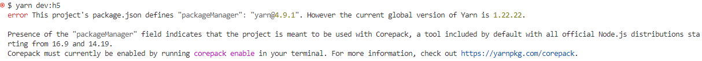

# CCNC H5 用户端

uni-app + Vue3 + TS + Vite + Pinia + wot-design-uni

**UI 参考**：`新建文件夹/H5`（碳中和服务平台）  
**样式规范**：[docs/H5UI规范.md](../docs/H5UI规范.md)

- 设计变量：`src/styles/variables.scss`（全局 SCSS 注入）
- 页面混入：`src/styles/mixins.scss`
- 格式化：`src/utils/format.ts`（收益率、金额）

```bash
pnpm dev:h5   # http://localhost:5174
```

---

#### 介绍

uniapp vue3 ts vite pinia axios router-next wot design

### 安装运行

```
yarn
yarn dev (小程序环境)
yarn dev:h5
...
具体查看package.json
```

### mock

项目可以使用 mock 接口，在 mock 文件夹下，接口前缀必须是 mock

### 分包

在 pages.json 中， 与 pages 同级添加
"subPackages": [
{
"root": "subPages",
"pages": [
]
}
],

#### 启动时

如果启动时报错

两种方案：

- 将 yarn 升级至 4.9.1 版本(需开启 core,嫌麻烦可看第二步)
- 将 package.json 页面中的最底部

```
"packageManager": "yarn@4.9.1+sha512.f95ce356460e05be48d66401c1ae64ef84d163dd689964962c6888a9810865e39097a5e9de748876c2e0bf89b232d583c33982773e9903ae7a76257270986538"
这一行删除, 重新执行yarn
```

### 模拟请求

- 请求时可以实现 mock 方式请求，但是需要将接口前缀写为 mock。 如：

```typescript
api.ts
// mock 请求示例
export function fetchMockTest() {
	return request<IHttpResponse>({
		url: `/mock/getMockData`,
		method: "GET",
	});
}

index.vue
import { fetchMockTest } from "./api.ts";
const handleRequest = () => {
	fetchMockTest().then((res) => {
		console.log(res);
	});
};
注： mock请求只在小程序下有效，h5无效!!
```

### css 使用

可在 scr/static/css/base.scss 、 scr/static/css.index.scss 查看公共样式


### components
+ navbar
```vue
<template>
<Navbar :title="title" :theme="navBarOpacity >= 1 ? 'dark' : 'light'"
            :background="`rgba(255, 255, 255, ${navBarOpacity})`" />
<Navbar :title="title" :theme="navBarOpacity >= 1 ? 'dark' : 'light'"
            :background="`rgba(255, 255, 255, ${navBarOpacity})`" placeholder/>
</template>
<script>
import { onPageScroll } from "@dcloudio/uni-app";
import Navbar from "@/components/navbar/navbar.vue";

const navBarOpacity = ref(0)
const placeholder = ref(true); // placeholder = true, 顶部导航栏会占顶部高度，和navbar平级的元素会正常显示在navbar下方
onPageScroll((e) => {
	navBarOpacity.value = e.scrollTop / 50;
});
</script>
```